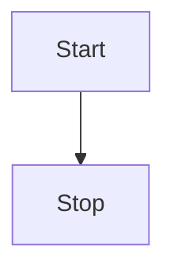
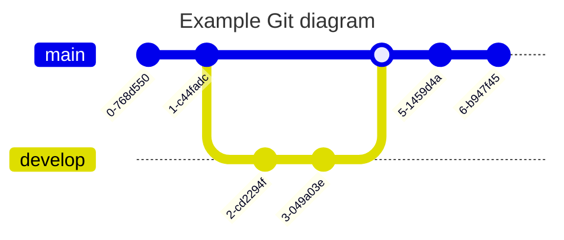

## 段落文本 p

```markdown
<font color=#00ffff size=7> color=#00ffff </font>
<p style="text-align: left">我是居中文字</p>
<font color=#00ffff size=7> color=#00ffff </font>
<p style="text-align: left">我是居中文字</p>
<font color=#00ffff size=7> color=#00ffff </font>
<p style="text-align: left">我是居中文字</p>
<font color=#00ffff size=7> color=#00ffff </font>
<p style="text-align: left">我是居中文字</p>
<font color=#00ffff size=7> color=#00ffff </font>
<p style="text-align: left">我是居中文字</p>
<font color=#00ffff size=7> color=#00ffff </font>
<p style="text-align: left">我是居中文字</p>
<font color=#00ffff size=7> color=#00ffff </font>
<p style="text-align: left">我是居中文字</p>
```

:::tabs

== tab 标签语法

```markdown
<font color=#00ffff size=7> color=#00ffff </font>
<p style="text-align: left">我是居中文字</p>
```

== tab 配置参数

颜色: color 十六进制值
大小: size 数字值(number)

p标签支持写 自定义css

== tab 样式预览

<font color=#00ffff size=7> color=#00ffff </font>
<p style="text-align: left">我是居中文字</p>

== tab 示例源码

```markdown
<font color=#00ffff size=7> color=#00ffff </font>
<p style="text-align: left">我是居中文字</p>
```

:::


## 😲 示例


### 🤖 基本演示

**加粗**，<u>下划线</u>，_斜体_，~~删除线~~，上标^26^，下标~1~，`inline code`，[超链接](https://github.com/imzbf)

> 引用：《I Have a Dream》

1. So even though we face the difficulties of today and tomorrow, I still have a dream.
2. It is a dream deeply rooted in the American dream.
3. I have a dream that one day this nation will rise up.

- [ ] 周五
- [ ] 周六
- [x] 周天


## 🤗 代码演示

```vue
<template>
  <MdEditor v-model="text" />
</template>

<script setup>
import { ref } from 'vue';
import { MdEditor } from 'md-editor-v3';
import 'md-editor-v3/lib/style.css';

const text = ref('Hello Editor!');
</script>
```

## 🖨 文本演示

依照普朗克长度这项单位，目前可观测的宇宙的直径估计值（直径约 930 亿光年，即 8.8 × 10^26^ 米）即为 5.4 × 10^61^倍普朗克长度。而可观测宇宙体积则为 8.4 × 10^184^立方普朗克长度（普朗克体积）。

## 📈 表格演示

| 表头 1 |  表头 2  | 表头 3 |
| :----- | :------: | -----: |
| 左对齐 | 中间对齐 | 右对齐 |

## 📏 公式

行内：$x+y^{2x}$

$$
\sqrt[3]{x}
$$

## 🧬 图表





## 🪄 提示

!!! success 支持的类型

note、abstract、info、tip、success、question、warning、failure、danger、bug、example、quote、hint、caution、error、attention

!!!

## ☘️ 占个坑@！

没了