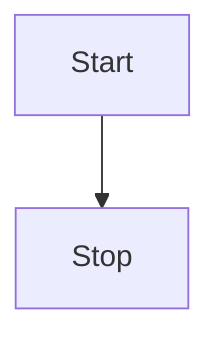
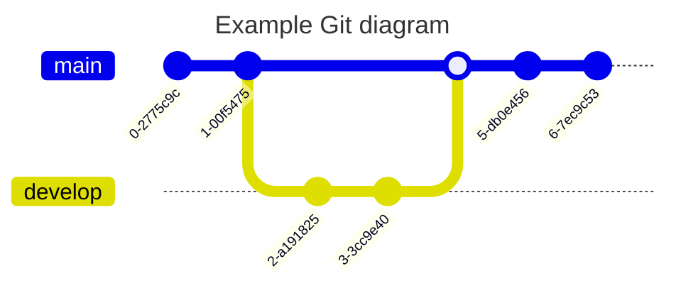

# 欢迎使用 Anheyu-App

这是一篇系统生成的默认文章，你可以编辑或删除它。

## 段落文本 p

```markdown
<font color=#00ffff size=7> color=#00ffff </font>

<p style="text-align: left">我是居中文字</p>
<font color=#00ffff size=7> color=#00ffff </font>
<p style="text-align: left">我是居中文字</p>
<font color=#00ffff size=7> color=#00ffff </font>
<p style="text-align: left">我是居中文字</p>
<font color=#00ffff size=7> color=#00ffff </font>
<p style="text-align: left">我是居中文字</p>
<font color=#00ffff size=7> color=#00ffff </font>
<p style="text-align: left">我是居中文字</p>
<font color=#00ffff size=7> color=#00ffff </font>
<p style="text-align: left">我是居中文字</p>
<font color=#00ffff size=7> color=#00ffff </font>
<p style="text-align: left">我是居中文字</p>
```

:::tabs

== tab 标签语法

```markdown
<font color=#00ffff size=7> color=#00ffff </font>

<p style="text-align: left">我是居中文字</p>
```

== tab 配置参数

颜色: color 十六进制值
大小: size 数字值(number)

p 标签支持写 自定义 css

== tab 样式预览

<font color=#00ffff size=7> color=#00ffff </font>

<p style="text-align: left">我是居中文字</p>

== tab 示例源码

```markdown
<font color=#00ffff size=7> color=#00ffff </font>

<p style="text-align: left">我是居中文字</p>
```

:::

### 🤖 基本演示

**加粗**，<u>下划线</u>，_斜体_，~~删除线~~，上标^26^，下标~1~，`inline code`，[超链接](https://github.com/imzbf)

> 引用：《I Have a Dream》

1. So even though we face the difficulties of today and tomorrow, I still have a dream.
2. It is a dream deeply rooted in the American dream.
3. I have a dream that one day this nation will rise up.

- [ ] 周五
- [ ] 周六
- [x] 周天


## 🤗 代码演示

```vue
<template>
  <MdEditor v-model="text" />
</template>

<script setup>
import { ref } from "vue";
import { MdEditor } from "md-editor-v3";
import "md-editor-v3/lib/style.css";

const text = ref("Hello Editor!");
</script>
```

## 🖨 文本演示

依照普朗克长度这项单位，目前可观测的宇宙的直径估计值（直径约 930 亿光年，即 8.8 × 10^26^ 米）即为 5.4 × 10^61^倍普朗克长度。而可观测宇宙体积则为 8.4 × 10^184^立方普朗克长度（普朗克体积）。

## 📈 表格演示

| 表头 1 |  表头 2  | 表头 3 |
| :----- | :------: | -----: |
| 左对齐 | 中间对齐 | 右对齐 |

## 📏 公式

行内：$x+y^{2x}$

$$
\sqrt[3]{x}
$$

## 🧬 图表





## 🪄 提示

!!! success 支持的类型

note、abstract、info、tip、success、question、warning、failure、danger、bug、example、quote、hint、caution、error、attention

!!!

## 折叠框

1. 折叠框
   ::: folding
   查看详情
   这是折叠框的内容
   :::
2. 默认打开的折叠框
   ::: folding open
   查看默认打开的折叠框
   这是一个默认打开的折叠框。
   :::
3. 带十六进制颜色
   ::: folding #ca1b1b
   查看红色折叠框
   这是一个红色主题的折叠框。
   :::
4. 带颜色且默认打开
   ::: folding open #ca1b1b
   查看默认打开的红色折叠框
   这是一个默认打开的红色折叠框。
   :::

## 隐藏块

:::hidden display=查看答案 bg=#FF7242 color=#fff
傻子，怎么可能有答案
:::

这是一个谜语：为什么西装很酷？{hide display=查看答案 bg=#FF7242 color=#fff}因为西装裤(C 装酷){/hide}

## 文本

这是{u}带下划线的文本{/u}

这是{emp}带着重号的文本{/emp}

这是{wavy}带波浪线的文本{/wavy}

这是{del}带删除线的文本{/del}

按{kbd}command + D{/kbd}可以复制当前行

密码是：{psw}这里没有验证码{/psw}

这是{u color=#FF0000}红色下划线{/u}文本

这是{emp color=#0066FF}蓝色着重号{/emp}文本

这是{wavy color=#00CC66}绿色波浪线{/wavy}文本

这是{del color=#9933FF}紫色删除线{/del}文本

按{kbd color=#FF6600}Ctrl + C{/kbd}复制

密码：{psw color=#FF69B4}secret123{/psw}

## 按钮

:::tabs active=3

== tab 标签语法

```markdown
{btn url=链接地址 text=按钮文字}{/btn}

{btn url=链接地址 text=按钮文字 icon=图标类名 color=颜色 style=样式 layout=布局 position=位置 size=大小}{/btn}
```

== tab 配置参数

**必填参数**：

- `url`: 链接地址
- `text`: 按钮文字

**可选参数**：

- `icon`: 图标类名（默认：anzhiyu-icon-circle-arrow-right）
- `color`: 颜色主题
  - default（默认主题色）
  - blue（蓝色）
  - pink（粉色）
  - red（红色）
  - purple（紫色）
  - orange（橙色）
  - green（绿色）
- `style`: 按钮样式
  - 留空（实心按钮，默认）
  - outline（空心按钮）
- `layout`: 布局方式
  - 留空（行内布局，默认）
  - block（块级布局）
- `position`: 按钮位置（仅 layout=block 时有效）
  - 留空（左对齐，默认）
  - center（居中）
  - right（右对齐）
- `size`: 按钮大小
  - 留空（普通大小，默认）
  - larger（大号按钮）

== tab 样式预览

**基础按钮**

{btn url=https://blog.anheyu.com/ text=AnZhiYu}{/btn}

**颜色主题**

{btn url=# text=Default}{/btn}
{btn url=# text=Blue color=blue}{/btn}
{btn url=# text=Pink color=pink}{/btn}
{btn url=# text=Red color=red}{/btn}
{btn url=# text=Purple color=purple}{/btn}
{btn url=# text=Orange color=orange}{/btn}
{btn url=# text=Green color=green}{/btn}

**空心按钮**

{btn url=# text=Default style=outline}{/btn}
{btn url=# text=Blue color=blue style=outline}{/btn}
{btn url=# text=Pink color=pink style=outline}{/btn}
{btn url=# text=Green color=green style=outline}{/btn}

**块级按钮（左中右）**

{btn url=# text=左对齐按钮 layout=block}{/btn}
{btn url=# text=居中按钮 layout=block position=center}{/btn}
{btn url=# text=右对齐按钮 layout=block position=right}{/btn}

**大号按钮**

{btn url=# text=大号实心按钮 color=purple size=larger}{/btn}
{btn url=# text=大号空心按钮 color=orange style=outline size=larger}{/btn}

**自定义图标**

{btn url=https://github.com text=GitHub icon=anzhiyu-icon-github color=blue}{/btn}
{btn url=# text=下载 icon=anzhiyu-icon-download color=green}{/btn}

== tab 示例源码

```markdown
<!-- 基础用法 -->

{btn url=https://blog.anheyu.com/ text=AnZhiYu}{/btn}

<!-- 带颜色 -->

{btn url=# text=蓝色按钮 color=blue}{/btn}
{btn url=# text=粉色按钮 color=pink}{/btn}

<!-- 空心样式 -->

{btn url=# text=空心按钮 style=outline}{/btn}
{btn url=# text=蓝色空心 color=blue style=outline}{/btn}

<!-- 块级布局 -->

{btn url=# text=左对齐 layout=block}{/btn}
{btn url=# text=居中 layout=block position=center}{/btn}
{btn url=# text=右对齐 layout=block position=right}{/btn}

<!-- 大号按钮 -->

{btn url=# text=大按钮 size=larger}{/btn}

<!-- 组合使用 -->

{btn url=# text=立即开始 color=green layout=block position=center size=larger}{/btn}

<!-- 自定义图标 -->

{btn url=https://github.com text=GitHub icon=anzhiyu-icon-github color=blue}{/btn}

<!-- 多按钮并排 -->

{btn url=#download text=下载 color=blue}{/btn}
{btn url=#docs text=文档 color=green}{/btn}
{btn url=#about text=关于 color=orange style=outline}{/btn}
```

== tab 高级技巧

**响应式按钮组**

在移动端和桌面端都能良好展示的按钮组合：

{btn url=#feature1 text=功能一 color=blue}{/btn}
{btn url=#feature2 text=功能二 color=green}{/btn}
{btn url=#feature3 text=功能三 color=orange}{/btn}

**行动号召按钮**

突出重要操作的大号居中按钮：

{btn url=#start text=立即开始使用 color=purple layout=block position=center size=larger}{/btn}

**次要操作按钮**

使用空心样式表示次要操作：

{btn url=#learn text=了解更多 style=outline layout=block position=center}{/btn}

== tab 最佳实践

1. **颜色选择**

   - 主要操作用实心按钮（默认、blue、green）
   - 次要操作用空心按钮（outline）
   - 警告操作用 red 或 orange
   - 特殊强调用 pink 或 purple

2. **布局建议**

   - 多个按钮并排时使用行内布局（默认）
   - 单个重要按钮使用块级居中布局
   - 表单提交按钮使用块级布局

3. **尺寸使用**

   - 普通内容使用默认尺寸
   - 重要行动号召使用 larger 尺寸
   - 移动端考虑使用 larger 增加点击区域

4. **图标规范**
   - 外链使用 anzhiyu-icon-external-link
   - 下载使用 anzhiyu-icon-download
   - GitHub 使用 anzhiyu-icon-github
   - 默认箭头 anzhiyu-icon-circle-arrow-right

:::

## tab 分栏

:::tabs

== tab 标签语法

```markdown
:::tabs
== tab 标签 1
内容 1
== tab 标签 2
内容 2
== tab 标签 3
内容 3
:::
```

**指定默认选中**

```markdown
:::tabs active=2
== tab 标签 1
内容 1
== tab 标签 2
内容 2（默认选中）
== tab 标签 3
内容 3
:::
```

== tab 配置参数

**基础语法**：

- 使用 `:::tabs` 开始标签容器
- 使用 `== tab 标题` 标记每个标签页
- 使用 `:::` 结束标签容器

**可选参数**：

- `active=数字`: 指定默认激活的标签（从 1 开始计数）
  - 不设置时默认激活第一个标签
  - 数字超出范围会降级为第一个标签
  - 示例：`:::tabs active=2` 表示默认激活第二个标签

**内容支持**：

- ✅ 完整的 Markdown 语法
- ✅ 代码块（支持语法高亮）
- ✅ 图片、链接
- ✅ 列表、表格
- ✅ 其他插件（按钮、隐藏内容、折叠框等）

**注意事项**：

- `:::tabs` 和 `:::` 必须独占一行
- `== tab` 必须在行首
- 标签标题不能为空

== tab 样式预览

**基础标签切换**

可以在不同标签页之间切换内容，第一个标签默认选中。

**带按钮的标签**

标签页内可以包含按钮：

{btn url=#demo text=在线演示 color=blue}{/btn}
{btn url=#docs text=查看文档 color=green}{/btn}

**带代码的标签**

标签页内可以包含代码块：

```javascript
console.log("Hello World");
```

**带隐藏内容的标签**

标签页内可以使用隐藏内容：

{hide display=查看答案}这是隐藏的内容{/hide}

**带文本样式的标签**

标签页内可以使用各种文本样式：

{u}下划线{/u}、{emp}着重号{/emp}、{wavy}波浪线{/wavy}、{del}删除线{/del}

== tab 最佳实践

**1. 标签标题命名**

- ✅ 简洁明了：HTML、CSS、JavaScript
- ✅ 长度建议：2-8 个字
- ✅ 避免特殊符号
- ❌ 不要过长：如何在 Windows 系统上完成安装

**2. 标签数量建议**

- ✅ 推荐 2-6 个标签
- ⚠️ 超过 6 个考虑拆分内容
- ❌ 避免只有 1 个标签

**3. 内容组织**

- 第一个标签放最常用内容
- 使用 `active` 参数突出重点
- 相关内容归为一组
- 保持各标签内容量均衡

**4. 默认激活策略**

- `active=1`：最常用、最基础的内容
- `active=2` 或更后：进阶内容、特殊场景
- 教程类：从第一个开始
- 对比类：激活最推荐的选项

**5. 嵌套建议**

- ✅ 可嵌套：折叠框、隐藏内容、按钮
- ✅ 可嵌套：文本样式插件
- ⚠️ 谨慎嵌套：Tabs 嵌套 Tabs（不超过 2 层）
- ❌ 避免过度嵌套导致结构混乱

**6. 响应式考虑**

- 标签按钮会自动换行适配移动端
- 移动端建议使用较短的标题
- 保持标题长度一致更美观

**7. 代码块处理**

- 代码块中的 `:::` 和 `== tab` 会被正确忽略
- 可以安全地在代码块内展示 Tabs 语法
- 代码块结束标记必须是纯 ` ``` `

:::

## LinkCard

LinkCard 插件可以创建美观的链接卡片，用于展示外部链接信息。

### 基础用法

{linkcard url=https://blog.anheyu.com title=安知鱼 sitename=AnZhiYu}{/linkcard}

```markdown
{linkcard url=https://blog.anheyu.com title=安知鱼 sitename=AnZhiYu}{/linkcard}
```

### 自定义图标

#### 字体图标

{linkcard url=https://github.com title=GitHub sitename=代码托管平台 icon=anzhiyu-icon-github}{/linkcard}

```markdown
{linkcard url=https://github.com title=GitHub sitename=代码托管平台 icon=anzhiyu-icon-github}{/linkcard}
```

#### HTTP 图标链接

{linkcard url=https://www.google.com title=Google sitename=搜索引擎 icon=https://www.google.com/favicon.ico}{/linkcard}

{linkcard url=https://github.com title=GitHub sitename=代码托管平台 icon=https://github.githubassets.com/favicons/favicon.png}{/linkcard}

```markdown
{linkcard url=https://www.google.com title=Google sitename=搜索引擎 icon=https://www.google.com/favicon.ico}{/linkcard}

{linkcard url=https://github.com title=GitHub sitename=代码托管平台 icon=https://github.githubassets.com/favicons/favicon.png}{/linkcard}
```

### 自定义提示文本

{linkcard url=https://www.google.com title=Google sitename=搜索引擎 tips=访问搜索引擎}{/linkcard}

```markdown
{linkcard url=https://www.google.com title=Google sitename=搜索引擎 tips=访问搜索引擎}{/linkcard}
```

### 完整示例

{linkcard url=https://docs.anheyu.com title=AnZhiYu 文档 sitename=AnZhiYu Docs icon=anzhiyu-icon-book tips=查看完整文档}{/linkcard}

```markdown
{linkcard url=https://docs.anheyu.com title=AnZhiYu 文档 sitename=AnZhiYu Docs icon=anzhiyu-icon-book tips=查看完整文档}{/linkcard}
```

### 多个链接卡片

{linkcard url=https://blog.anheyu.com title=安知鱼博客 sitename=AnZhiYu Blog}{/linkcard}

{linkcard url=https://github.com/anzhiyu-c title=AnZhiYu GitHub sitename=GitHub Repository icon=https://github.githubassets.com/favicons/favicon.png}{/linkcard}

{linkcard url=https://www.bilibili.com title=哔哩哔哩 sitename=B 站 icon=https://www.bilibili.com/favicon.ico tips=观看视频}{/linkcard}

```markdown
{linkcard url=https://blog.anheyu.com title=安知鱼博客 sitename=AnZhiYu Blog}{/linkcard}

{linkcard url=https://github.com/anzhiyu-c title=AnZhiYu GitHub sitename=GitHub Repository icon=https://github.githubassets.com/favicons/favicon.png}{/linkcard}

{linkcard url=https://www.bilibili.com title=哔哩哔哩 sitename=B 站 icon=https://www.bilibili.com/favicon.ico tips=观看视频}{/linkcard}
```

### 参数说明

| 参数     | 说明                           | 类型   | 可选值                       | 默认值            |
| -------- | ------------------------------ | ------ | ---------------------------- | ----------------- |
| url      | 链接地址                       | string | -                            | #                 |
| title    | 链接标题                       | string | -                            | 链接标题          |
| sitename | 网站名称                       | string | -                            | 网站名称          |
| icon     | 图标（字体图标类名或图片链接） | string | 字体图标类名或 HTTP 图片链接 | anzhiyu-icon-link |
| tips     | 提示文本                       | string | -                            | 引用站外地址      |

### 注意事项

- 链接会在新标签页中打开
- 自动添加 `rel="external nofollow noreferrer"` 属性
- 图标支持两种方式：
  - **字体图标**：使用 AnZhiYu 图标字体类名（如 `anzhiyu-icon-github`）
  - **图片图标**：使用 HTTP/HTTPS 图片链接（如网站 favicon）
- 图片图标会自动调整为 20x20 像素，带圆角效果
- 卡片具有悬停效果和点击反馈
- 适合用于推荐相关链接或引用外部资源

## ☘️ 占个坑@！

没了
